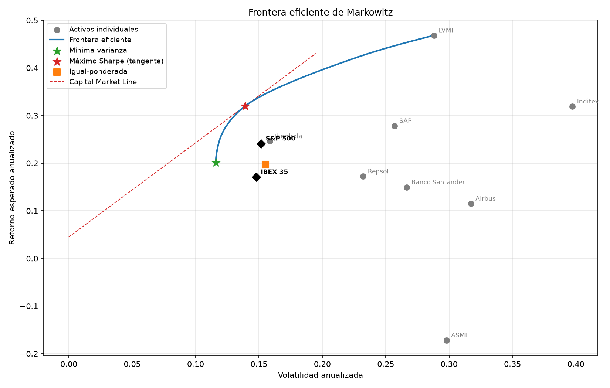
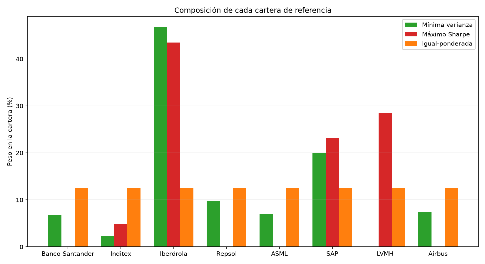

# 📊 Markowitz Portfolio Optimization

> From measuring risk to deciding what to hold: the efficient frontier, the minimum-variance portfolio, and the maximum-Sharpe (tangency) portfolio, computed on 8 real European stocks.


---

## What it does

Implements **Markowitz (1952) mean-variance portfolio optimization**: given the expected return and covariance matrix of a set of assets, it computes the **efficient frontier** (the set of portfolios offering the lowest risk for each level of return), the **minimum-variance portfolio**, and the **maximum-Sharpe portfolio** (the tangency portfolio with the risk-free asset — where the Capital Market Line touches the frontier). All three are solved as constrained optimization problems (`scipy.optimize.minimize`, SLSQP) over portfolio return/risk formulas that are written out explicitly.

The investable universe is the same 8 liquid European/Spanish stocks used in Project 1; the IBEX 35 and S&P 500 indices are plotted as reference points (you can't literally invest in an index directly, so they don't enter the optimization) to see how the optimized portfolios compare against them.

## Why this project is different from the rest of the portfolio

Every prior project **measures** risk (historical volatility, VaR, GARCH) or **prices** something (options, credit risk) — this is the first **prescriptive** project: given the risk already measured, it decides what to actually hold. It's the natural next step after Projects 1, 5 and 8.

## Dashboard preview

| Efficient frontier | Portfolio composition |
|---|---|
|  |  |

The full interactive version is in [`outputs/dashboard.html`](outputs/dashboard.html): just double-click to open it, no server required.

## Project structure

```
markowitz-efficient-frontier/
├── README.md
├── requirements.txt
├── config/
│   └── portfolio.py         <- investable universe, benchmarks, risk-free rate, frontier resolution
├── data/                    <- cached price snapshots (record, not a read cache)
├── notebooks/               <- Jupyter exploration
├── src/
│   ├── data.py                  <- historical prices -> daily log returns, multi-ticker (yfinance)
│   ├── markowitz.py               <- the model: mean/cov, min-variance, efficient frontier, max-Sharpe
│   ├── visualize.py                 <- static charts (matplotlib): frontier + portfolio composition
│   ├── dashboard.py                   <- interactive dashboard (Plotly) -> outputs/dashboard.html
│   └── main.py                          <- orchestrates the pipeline
└── outputs/                 <- generated charts and dashboard
```

## How to run it

```bash
python -m venv venv
source venv/bin/activate  # on Windows: venv\Scripts\activate
pip install -r requirements.txt
python src/main.py
```

On completion, the console prints the return/risk/Sharpe of each reference portfolio and the composition of the maximum-Sharpe portfolio, and the following are generated in `outputs/`: `efficient_frontier.png`, `portfolio_weights.png` and `dashboard.html`.

### A note on SSL certificates
Same mechanism as in the earlier projects: if `yfinance` fails with `CERTIFICATE_VERIFY_FAILED` (typical with antivirus software that inspects HTTPS traffic, e.g. Norton), `src/data.py` automatically uses a local certificate bundle at `.certs/cacert.pem` if present.

## The model

For a weight vector `w` (one per asset, `sum(w)=1`), with annualized expected return vector `mu` and annualized covariance matrix `Sigma`:

```
portfolio return:      R(w) = w' * mu
portfolio risk:        sigma(w) = sqrt(w' * Sigma * w)
```

Three reference portfolios, all solved with `scipy.optimize.minimize` (SLSQP) over the formulas above, long-only (`0 <= w <= 1`, no short-selling — the standard first-pass constraint):

1. **Minimum variance**: minimize `sigma(w)^2` subject to `sum(w)=1`.
2. **Efficient frontier**: repeat the minimization above adding the constraint `w'*mu = target`, for a grid of targets between the minimum-variance return and the highest-`mu` asset's return — each point on the grid is a distinct optimal portfolio; the curve they trace is the efficient frontier.
3. **Maximum Sharpe (tangency portfolio)**: maximize `(R(w) - r_f) / sigma(w)`. Geometrically, it's the point on the frontier where the line from `(0, r_f)` is tangent — the **Capital Market Line**.

An **equal-weighted** portfolio (`w_i = 1/N`) is added as a naive benchmark that uses no information from `mu` or `Sigma` at all.

## Results

_(live data — the same 8-stock universe as Project 1)_

| Portfolio | Return | Volatility | Sharpe |
|---|---|---|---|
| Minimum variance | +20.12% | 11.60% | 1.35 |
| Maximum Sharpe | +32.02% | 13.92% | 1.98 |
| Equal-weighted | +19.69% | 15.51% | 0.98 |
| IBEX 35 (benchmark, not investable) | +17.10% | 14.79% | — |
| S&P 500 (benchmark, not investable) | +24.11% | 15.16% | — |

**Maximum-Sharpe portfolio composition**: Iberdrola 43.5%, LVMH 28.4%, SAP 23.2%, Inditex 4.9% — the other 4 of 8 assets get essentially zero weight.

## Key findings

- **Diversification is directly measurable, not just a slogan**: the minimum-variance portfolio's volatility (11.60%) is *lower than the least volatile individual stock* (Iberdrola, 15.85%) — combining imperfectly-correlated assets produces a portfolio safer than its single safest ingredient, the concrete payoff of `Sigma` having off-diagonal terms less than 1.
- **The maximum-Sharpe portfolio beats every individual asset and the equal-weighted portfolio on Sharpe by construction** (1.98 vs. the best individual stock at 1.47, vs. 0.98 equal-weighted) — that's not a coincidence, it's exactly what the optimizer is asked to do. The real question is whether it's *trustworthy going forward*, and the next finding is why the honest answer is "not entirely."
- **The optimizer's textbook flaw shows up immediately: it's dangerously concentrated.** Half the universe (4 of 8 stocks) gets essentially zero weight, and 43.5% sits in a single name (Iberdrola). This is the classic Michaud critique of Markowitz optimization: because `mu` and `Sigma` are *estimates*, not known constants, the optimizer routes weight aggressively toward whichever assets *happened* to look best in the specific historical window used — it "maximizes estimation error" as much as it maximizes genuine risk-adjusted return. A production version would need shrinkage estimators for `Sigma`, resampling, or explicit position caps to control this.

## Concepts to be able to explain in an interview

- **The efficient frontier and the Capital Market Line**: why the tangency portfolio is the *only* risky portfolio a rational investor combines with the risk-free asset (the Separation Theorem), and why every point on the CML dominates every point on the frontier except the tangency portfolio itself.
- **Why long-only changes the problem**: without the `0<=w<=1` bounds, Markowitz optimization is a linear-algebra problem with a closed-form solution; the bounds turn it into a genuine constrained numerical optimization (which is why `scipy.optimize` is needed here at all, unlike a plain closed-form matrix computation).
- **Estimation error and the Michaud critique**: why an optimizer that looks mathematically optimal on historical `mu`/`Sigma` can perform poorly out-of-sample, and why practitioners rarely use raw Markowitz output unmodified.
- **Sharpe ratio as the object actually being optimized**: why maximizing Sharpe, not return alone, is what "efficient" means in this context — and why a very low-volatility, very low-return asset can still have a mediocre Sharpe despite "looking safe."
